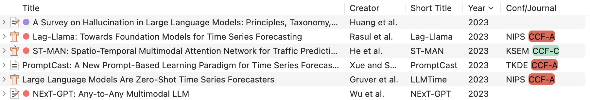

# Zotero AutoAbbr

This plugin is for automatically assign abbreviation for conferences/journals.

+ `Conference on Neural Information Processing Systems` -> `NeurIPS`
+ `Proceedings of the International Conference on Machine Learning` -> `ICML`
+ `Proceedings of the Annual Meeting of the Association for Computational Linguistics` -> `ACL`

## Usage

### Basic Usage

1. Download the plugin from `release`.
2. Tools -> Plugins -> "Gear" Button top-right -> Install Plugin from File.
3. Select the downloaded `.xpi` file.
4. Add the new column `Conf/Journal`.

**Note: This plugin is currently only support `Conference Paper` and `Journel Article`!!!**

### Manually Edit Abbreviation for each Item

1. Select the item you want to edit
2. Stroll to the bottom of the panel on the right
3. Edit the abbreviation manually

### Edit Auto Rules

1. Open `preferences`. Select `AutoAbbr` on the left.
2. Click `edit` to open rule file.
3. Click `update` to apply the new rules.
4. (optional) Click `reset` to reset rules to default.

## Thanks

This plugin is built based on the follow template

Please feel free to raise issues.